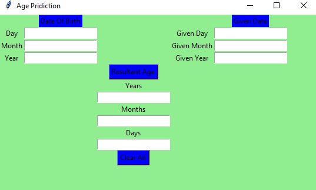
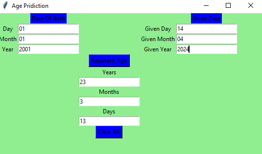

# Age Prediction Application

<p align="justify"> This application calculates the age based on the date of birth and a given date using a simple GUI built with Python's tkinter library.</p>

## Features

- **Calculate Age**: Compute age in years, months, and days from the provided date of birth to the given date.
- **Clear Inputs**: Reset all input fields to start fresh calculations.
- **Error Handling**: Alerts if any field is left empty before calculation.

## Requirements

- Python 3.x
- Tkinter library (usually included with Python)

## Setup and Usage

1. **Clone or download this repository** to your local machine.

2. **Run the script**:
   ```bash
   python your_file_name.py
   ```


### Interact with the GUI:
- Enter the date of birth and the date for which you want to calculate the age.
- Click Resultant Age to see the output.
- Use Clear All to reset all input fields.

## User Interface
### The GUI has a simple layout:

- Fields to enter the day, month, and year for both the date of birth and the given date.
- Buttons to perform calculations and to clear all fields.
- Display area for the resultant age in days, months, and years.

### Output Screen

- Initial GUI
#### GUI
  

- Predected age
#### Predected age
   